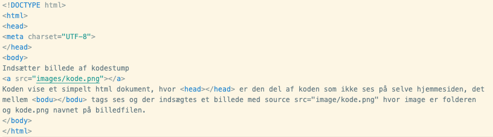

# Webteknologier
[link til web-style](https://mpsteenstrup.github.io/webteknologier/)

[link til github-style](https://github.com/mpsteenstrup/webteknologier)

## Indholdsfortegnelse
* [Internettet](##Internettet)
* [Projektbeskrivelse](#projektbeskrivelse-hjemmeside-til-præsentation-af-informatik-emned)
* [HTML programmering](#html-programmering)
* [Layout](#Layout)
* [Gestaltlovene](#gestaltlovene)
* [Farver](https://github.com/mpsteenstrup/InformatikRysensteen/blob/main/dokumenter/Interaktionsdesign.MD#farver)
* [Portfolie](#portfolie)
* [Dokumentation af kode](#dokumentation-af-kode-på-hjemmesider)
* [Github til hosting af websider](#github-til-hosting-af-websider)

## Internettet

* [Webteknologier 1, hvad er internettet](https://docs.google.com/presentation/d/1TTR3N7ilYQZZ0FdJGCxPvAx-VwPzGvcPsZ7QnUfQMxY/edit?usp=sharing)
* [Historien om internettet](filer/Historien_om_internettet_politiken2014.pdf)

<!---  
* [Webteknologier 2, projekt og HTML introduktion](/filer/Webteknologier2.pdf)
* [Webteknologier 3, CSS](/filer/Webteknologier3.pdf)
* [Webteknologier 4, design](/filer/Webteknologier4.pdf)
--->

## Introduktion
Internettet er den altdominerende teknologi til deling af information. I dette forløb vil vi se på internettets opbygning og hvilke teknologier der ligger bag. Som projekt skal I lave en hjemmeside og offentliggøre den på Github.


## Projektbeskrivelse, GCP: rejse-app til kommende rejseklasser.
I har alle været afsted på GCP rejser og har kroppen fyldt af spændende oplevelser og telefonerne fulde af billeder og videoklip. 

Til næste år skal nye 3.g elever til samme destinationer og I skal hjælpe dem med at begå sig i det fremmede.

Med baggrund i jeres store viden skal I lave en hjemmeside som mobil-app til hjælp på kommende rejser. 

Appen skal indeholde
* En hoveside med en kort introduktion af destinationen.
* Link og undersider med relevant information.
* Overskrift og afsnit.
* Billeder eller videoer.
* Styling med brug af CSS

I portfolien skal I dokumentere
* Beskrive de designprincipper I har brugt, herunder valg af farver.

## Læringsmål
It-systemers og menneskelig aktivitets gensidige påvirkning

Eleverne skal kunne:
* give eksempler på, hvordan it-systemer har betydning for og påvirker menneskelige aktiviteter It-sikkerhed, netværk og arkitektur.

It-sikkerhed, netværk og arkitektur

Eleverne skal kunne:
* redegøre for beskyttelse af egen digital identitet og egne data på internettet samt redegøre for tekniske og menneskelige aspekter af it-sikkerhed.
* redegøre for generelle principper bag it-systemers arkitekturer ved udarbejdelse af it-systemer og tilpasning af eksisterende it-systemer.

Interaktionsdesign:
* design af en brugergrænseflade og den tilhørende interaktion.


# HTML programmering
Det er mange ressourcer når man skal lære at programmere hjemmesider. W3schools har tutorials til mange forskellige programmeringssprog også til html.
I skal bruge en versione af ChatGPT til at lærer at lave hjemmesider. Her er et link, [https://poe.com/webteknologier2024](https://poe.com/webteknologier2024).

## Opbygning af hjemmeside
Her vil vi gennemgå det basale i forhold til at programmere en hjemmeside. De hjemmesider I skal lave bliver lavet i en tekst editor, vi bruger [Visual Studio Code](https://github.com/mpsteenstrup/InformatikRysensteen/blob/main/dokumenter/TekstEditorOgGithubTilmelding.md), og gemmes med endelsen ```.html```. Startsiden kaldes ofte index så filnavnet skal være ```index.html```.

Der er rigtigt mange ressourcer på nettet når man skal lave hjemmesider. Vi bruger guiden fra w3schools, [https://www.w3schools.com/html](https://www.w3schools.com/html/default.asp).

Her er den simpleste hjemmeside
```
<!DOCTYPE html>
<html>
<head>
<meta charset="UTF-8">
</head>
<body>
Hello world.
</body>
</html>
 ```
Elementerne er
* ```<>``` åbnings-tag og ```</>``` lukke-tag.
* Header mellem ```<head>..</head>```. Her defineres opsætningen af siden, men det som står bliver ikke vist på siden.
* Body ```<body>...</body>``` eller kroppen. Her skal alt tekst, billeder osv. som skal vises på siden være.
* Det hele omsluttes i ```<html>...</html>```.
* Øverst angives dokumenttypern, ```<!DOCTYPE html>```.

## Øvelse
* lav en mappe kaldet ```hjemmeside``` og åben mappen i VS code.
* Lav et nyt dokument og kopier koden ind i VS code.
* Gem filen som ```index.html```.
* Tryk på ```Go Live``` nederst til højre og hjememsiden er levende!.
* Skriv noget andet i stedet for Hello World og gem det.
* I behøver ikke at lukke browserwinduet, men kan bare opdatere det.
* Slet linjen ```<meta charset="UTF-8">``` og undersøg hvad der sker.

## Overskrifter, paragraffer osv.
For at lave noget struktur på hjemmesiden bruges tags for overskrift, paragraf osv. Her er en liste med tags.
* ```<h1>,<h2>,<h3>,<p>,<ol>,<ul>,<br>```
## Øvelse.
* Undersøg hvad de forskellige tags gør, brug evt. nettet til at slå det op.

## Links og billeder.
Vi vil  gerne have billeder og links til andre sider. Links laves med ```<a href="url link"> navnet på linket </a>```. Billeder gemmes i undermappen ```billeder```og indsættes med ``````.

## Øvelse
* opret en undermappe kaldet ```billeder``` og find et billede på nettet og placer det i mappen.
* Indsæt et link til en ekstern side, I vælger selv hvilken.
* Indsæt et billed fra fra nettet ved at bruge url-addressen.

### Relative links og lokale filer, HVOR ER MIN FIL???
Computere har en mappestruktur og filer ligger i mapper - det kommer måske som en chok. Det er en vigtig del af at være et dannet menneske at vide hvor sine ting er og det gælder også på computeren. På min computer ligger denne fil i mappen ```webteknologier``` under ```undervisning```. Den fulde sti til mappen er ```/Users/madspetersteenstrup/Documents/programming/Undervisning/webteknologier```. Som I kan se er hver undermappe angivet ved ```/```, på mac ```option,shift,7```.

## Øvelse
* Lav den mappe kaledet ```hjememside``` som I ikke gad ovenfor og placer et billede i undermappen ```billeder```.
* Lav et relativt link til billedet fra html dokumentet ``````.

Dette hedder et relativt link da det peget på billedet i mappen ```billeder``` som ligger i den mappe hvor ```index.html``` filen ligger. Det kan godt betale sig at holde noget struktur med billeder i en mappe og html filer i overmappen.

# Layout
Der er mange måder at lave layout til sin hjemmeside, men vi skal huske Steve Krugs overskrift til bogen **Don't make me think** om human-computer interaktion. Hvis vi kan designe interfacet så brugeren ikke skal tænke sig om gør det oplevelsen lettere for brugeren. Interaktionsdesign gennemgås på siden, [InformatikRysensteen/Interaktionsdesign](https://github.com/mpsteenstrup/InformatikRysensteen/blob/main/dokumenter/Interaktionsdesign.MD). Hvis hjemmesiderne ligner andre hjemmesider vil det være let for brugeren at finde rundt i.

Standardlayout


## Informatik Rysensteen siden
Vi arbejder os igennem siden til promovering af Informatik på Rysensteen,
[https://mpsteenstrup.github.io/webteknologier/InformatikRysensteen/index.html](https://mpsteenstrup.github.io/webteknologier/InformatikRysensteen/index.html).

## Øvelse
* Find ud af om jeg overholder min egen skabelon.
* Prøv at lav siden mindre eller se den på en telefon, hvordan forandres den?

Hele hjemmesiden kan downloades fra denne zip-fil, [https://github.com/mpsteenstrup/webteknologier/blob/main/InformatikRysensteen_kode.zip](https://github.com/mpsteenstrup/webteknologier/blob/main/InformatikRysensteen_kode.zip)

## Øvelse
* Hent zip-filen og fold den ud.
* Åben ```index.html``` filen.
* Undersøg hvilke filer der er i mappen.

Der er forskellige elementer i hjemmesiden som I skal have styr på,
* Elementer afgrænset i bokse.
* Styling med CSS.
* Placering af elementerne i forhold til hinanden.


## Afgrænsning i bokse
```div``` står for **Content Division element** og er en ramme for indhold. Vi bruger den til at specificere forskelligt design og layout. ```class``` giver elementer forskellige attributter, ud fra vores designvalg.

I eksemplet [class_capitals](https://www.w3schools.com/html/tryit.asp?filename=tryhtml_classes_capitals) fra w3schools.com, definere vi designet i ```<style>``` med ```.city { }``` og kalder designet med ```<div class="city">```.

### Øvelse
* Find start og slut tag ```<div>,</div>``` som hhv. afgrænser overskriften og menubaren.

I linje 22-25 står der
```
<div class="row">
  <div class="leftcolumn">
    <div class="card">
```
Hvert enkelt div tag hører sammen med et slut div tag

### Øvelse
* find slut taggene og forklar hvordan de tre bokse virker.

## Styling med CSS
De forskellige elementer på hjemmesiden skal styles forskelligt. Dette gøres et et CSS dokument som står for *Cascade Style Sheet*. Ved at lave et eksterne style sheet kan man referere til det fra alle html dokumenterne og man får derfor en konsistent ensartet styling. Det gør også at der kun er ét sted man skal lave om hvis man vil ændre stylingen.

css dokumenter, ```mystyle.css``` inlkuderes i html dokumentet i headeren
```
<head>
  <link rel="stylesheet" href="mystyle.css">
</head>
```
I CSS kan vi style vores elementer enten direkte eller gennem en *class*.
Direkte styling af elementer
```
body {                      
  font-family: Arial;       /* sætter font */
  padding: 10px;            /* margen omkring tekst */
  background: rgb(20,90,120);    /* farven */
}
```
Her styles ```body``` elementet med font, margen og baggrund. Man skriver altså navnet på det element man vil style og stylingen foregår imellem ```{}```. Når man bruger ```<body>``` taget har den valgte styling. 

*class* styling,
```
.leftcolumn {
  float: left;
  width: 75%;
}
```
class styling har punktum ```.``` før navnet og refereres til i html dokumentet som eks. ```<div class="leftcolumn">```.

### Øvelse
* Download de to filer [CSSIntroduktion.html](CSSIntroduktion.html) og [simple.css](simple.css) og åben siden.
* Lav om i stylingen.

## Mobil-app
Her er to eksempler på hjemmesider som kan ses på mobiltelefoner. Det kan gøres på rigtigt mange måder, men dette er en relativt simpel version.

* [Hjemmeside 1.](https://mpsteenstrup.github.io/webteknologier/mobilapp/index.html)
* [Hjemmeside 2.](https://mpsteenstrup.github.io/webteknologier/mobilapp/index2.html)

Mappen med koden er her

* [mobilapp](https://github.com/mpsteenstrup/webteknologier/tree/main/mobilapp) 

Den kan hentes ved at kopiere url'en ind her

* [https://download-directory.github.io/](https://download-directory.github.io/)

## Gestaltlovene
Gestaltlovene handler om hvordan vores hjerne omsætter synsindtryk til sammenhænge. Det er beskrevet her, [gestaltlovene](https://github.com/mpsteenstrup/InformatikRysensteen/blob/main/dokumenter/Interaktionsdesign.MD#gestaltlovene).

### Øvelse
Her er gestaltlovene, Nærhed, Lighed, Lukkethed, Forbundethed, Figur og baggrund.

* Vurder hvordan gestaltlovene kan bruges til at forklare [InformatikRysensteen hjemmesiden](https://mpsteenstrup.github.io/webteknologier/InformatikRysensteen/index.html).
* Kig på en anden hjemmeside og analyser med gestaltlovene.

## Logbog
Logbog er beskrevet her, [https://github.com/mpsteenstrup/InformatikRysensteen/blob/main/dokumenter/Logbog.md](https://github.com/mpsteenstrup/InformatikRysensteen/blob/main/dokumenter/Logbog.md)

Jeg har lavet en template til portfolie som I kan tage udgangspunkt i, [Template til portfolie](portfolieTemplate/index.html)

### Dokumentation af kode på hjemmesider
Det er vigtigt at dokumenterer sin kode så andre kan læse og forstå den. I skal kunne redegøre for hvad de forskellige delel i koden gør. Det gør I lettest ved at indsætte et billed af den del af koden I skal beskrive.

Eksempel


# Github til hosting af websider
Github er et online sted hvor udviklere lægger programmer, data og meget mere. Det er et versionsstyringsværktøj lavet til at arbejde på forskellige versione af samme software. Vi kommer ikke til at bruge denne feature men kun bruge
det til at have vores websider liggenden.

**Det anbefales generelt ikke at bruge specialtegn, æøå og mellemrum i filnavne.**

I kan bruge Github til at hoste jeres webside. Startsiden hedder ```index.html``` og skal placeres i roden af jeres github repository. I kan linke til undersider ved relative referencer, eks ```<a href="side2.html"> Link til side 2 </a>```.

I skal lave et nyt ```repository``` og uploade alt materialet til den.

Når det hele er uploadet skal I ind i settings, hjulet, og ned til ```Github Pages```.

Addressen på websiden er ```brugernavn.github.io/repository/```. Reklamesiden for Informatik ligger for eksempel på ```mpsteenstrup.github.io/webteknologier/InformatikRysensteen/```.

Her er en side til promovering af informatik.
[https://mpsteenstrup.github.io/webteknologier/InformatikRysensteen/index.html](https://mpsteenstrup.github.io/webteknologier/InformatikRysensteen/index.html)

Det kan godt kræve lidt tålmodighed at arbejde direkte i editoren på Github, da siden ikke altid opdatere så hurtigt. Man kan evt. prøve ```shift command R``` for hard reload af den side I vil se.
