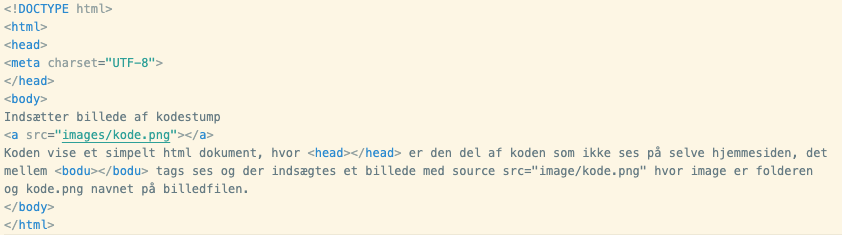

## kode på hjemmesider
Det er vigtigt at dokumenterer sin konde så andre kan læse og forstå den. I skal kunne redegøre for hvad de forskellige delel i koden gør. Det gør I lettest ved at indsætte et billed af den del af koden I skal beskrive.

Eksempel

test
